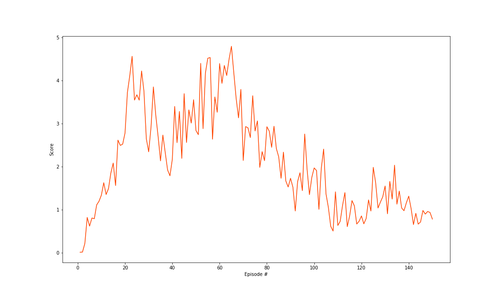
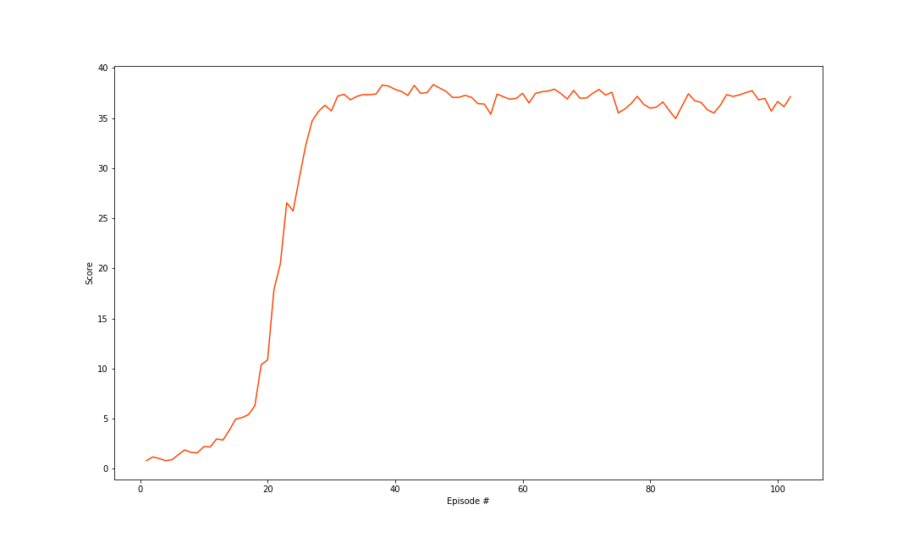
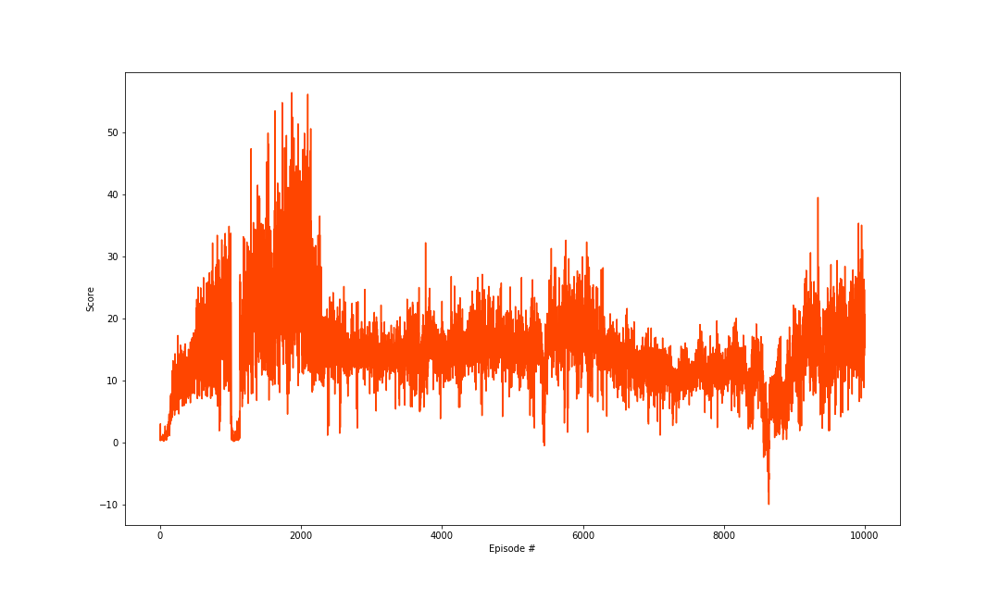

## Report on Reacher Continuous Control

### Model Architecture
The Udacity provided DDPG code in PyTorch was used and adapted for this 20 agent (version 2) environment.

The algorithm uses two deep neural networks (actor-critic) with the following struture (each one has a target network):
- Actor    
    - Hidden: (input, 256)  - ReLU
    - Hidden: (256, 128)    - ReLU
    - Output: (128, 4)      - TanH

- Critic
    - Hidden: (input, 256)              - ReLU
    - Hidden: (256 + action_size, 128)  - ReLU
    - Output: (128, 1)                  - Linear

### Hyperparameters
- Learning Rate: 1e-3 (Actor)
- Learning Rate: 1e-4 (Critic)
- Batch Size: 128
- Replay Buffer: 1e6
- Gamma: 0.99
- Tau: 1e-3
- Ornstein-Uhlenbeck noise parameters (0.15 theta and 0.2 sigma.)

## Results

There are several phenomenons showed up in this experiment worth to talked about.

### 1. Training Time

The first things is about the training time. In the beginning, the training time is extremely slow, about 2 episodes per minutes. I have overhauled a bunch of possible problems, finally I found out the reason is thatI implement the sample collecting process in the training roop. The specific part of the code is 

'''python
for s,a,r,ns,d in zip(states, actions, rewards, next_states, dones):
    agent.step(s,a,r,ns,d)
'''

And when I take these two lines into the 'step' method of Agent class, the training speed boosted!

I still cannot figure out why.

### 2. Exploration Noise Type

When I first implement the code, I had a reference to the action noise function in the Udacity's DDPG code interacting the pendulum env. I followed it and found out the performance of the uniform random value inside the OU algorithm is poor. And here is the training process of scores graph. 

So I change it to follow the original OU algorithm, which apply the which got really impressive results.

### 3. Analyzing the Udacity Admentation

   The indication in Udacity have such a improvement, quote "In particular, instead of updating the actor and critic networks 20 times at every timestep, we amended the code to update the networks 10 times after every 20 timesteps. The corresponding scores are plotted below."

   In my perspecitve, I think this way is just to delay the update rate, having no improvement on the real algorithm performance, which means it is just to make it seem reliable and stable in short term, but it still cannot last in the long run.  So what is the problem in Udacity orginal DDPG implement code? Well, I guess the reason is the noise type. 
  

## Future Work

I would like to implement A2C and PPO in the reacher and the crawler games in order to figure out which one has the best performance.